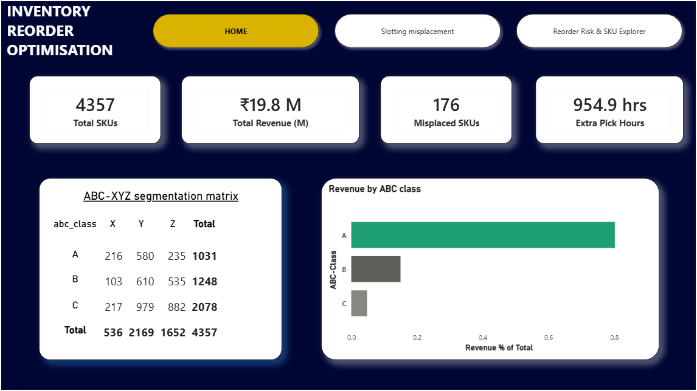
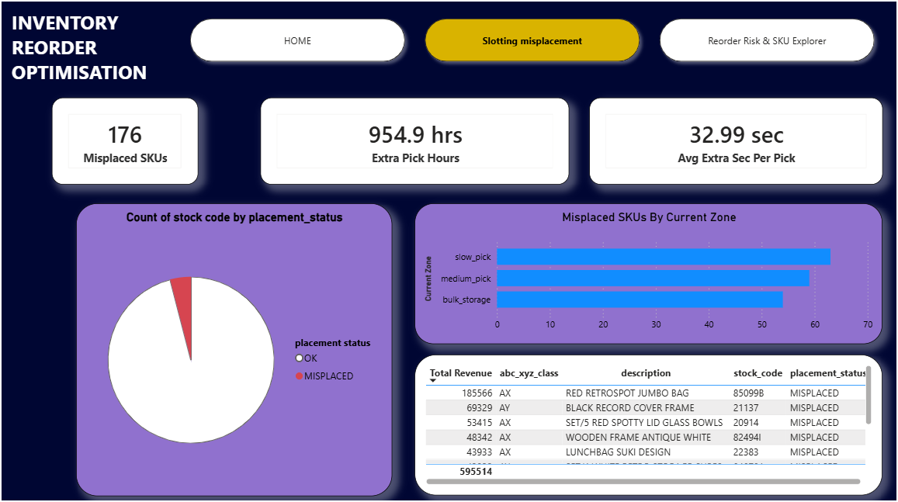
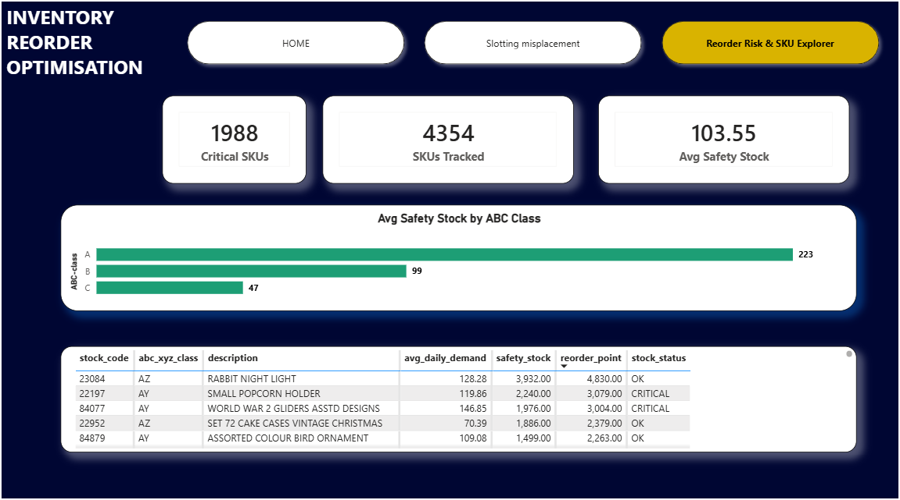

# Warehouse Slotting & Inventory Reorder Optimization

An end-to-end data analytics project that combines **ABC-XYZ inventory segmentation**, **warehouse slotting misplacement detection**, and **statistical safety stock / reorder point modeling** — built on real e-commerce transaction data and visualized in an interactive 3-page Power BI dashboard.

---

## 📊 Dashboard Preview

### Page 1 — Home / Inventory Overview


### Page 2 — Slotting Misplacement


### Page 3 — Reorder Risk & SKU Explorer


---

## 🧰 Tech Stack

- **MySQL** — data storage, SQL window functions for ABC/XYZ classification
- **Python** (Pandas, NumPy, SciPy) — demand variability analysis, safety stock modeling, pick-time impact estimation
- **Power BI** — 3-page interactive dashboard with DAX measures and cross-filtered visuals

---

## 📁 Dataset

**Online Retail II** (UCI Machine Learning Repository / Kaggle mirror)
~1,067,371 transaction rows spanning Dec 2009 – Dec 2011, covering UK e-commerce invoices.

Columns used: `Invoice`, `StockCode`, `Description`, `Quantity`, `InvoiceDate`, `Price`, `Customer ID`, `Country`

Data was cleaned to remove cancelled orders (`Invoice` starting with `'C'`), non-product line items (postage, manual charges, bank fees), and extreme bulk-order outliers before analysis.

---

## 🔍 Methodology

### 1. ABC Classification (SQL)
SKUs ranked by revenue and bucketed using the Pareto principle:
- **Class A**: SKUs contributing up to 80% of cumulative revenue
- **Class B**: next 15%
- **Class C**: remaining 5%

Built using `SUM() OVER (ORDER BY total_revenue DESC)` window functions in MySQL.

### 2. XYZ Classification (SQL)
Demand variability measured via **coefficient of variation** (CV = std dev ÷ mean) of monthly order quantity per SKU:
- **X**: CV < 0.5 (stable demand)
- **Y**: CV 0.5 – 1.0 (moderate variability)
- **Z**: CV > 1.0 (erratic demand)

### 3. Warehouse Zone Simulation
No public dataset includes real warehouse layout data, so zone assignment was simulated using a deterministic hash-based rule (`CRC32(stock_code)`), biased so that high-priority SKUs (AX/AY/BX) have an ~82% chance of correct fast-pick placement — producing a realistic ~20% misplacement rate rather than a fully random one.

### 4. Pick-Time Impact (Python)
For each misplaced priority SKU, extra picking time was estimated using a stated walking-speed assumption (1.2 m/s + 5 sec fixed pick/search overhead) applied to the difference between actual zone distance and an ideal fast-pick baseline distance, multiplied by historical order frequency.

### 5. Safety Stock & Reorder Point (Python)
Using the classic service-level formula:

```
Safety Stock = Z × σ_daily_demand × √(Lead Time)
Reorder Point = (Avg Daily Demand × Lead Time) + Safety Stock
```

Assumptions: 7-day supplier lead time, 95% service level (Z ≈ 1.65).

### 6. Current Stock Simulation
Since the dataset has no live inventory feed, current stock levels were simulated (hash-based, spread 40%–160% of each SKU's reorder point) to flag SKUs as `CRITICAL` (below reorder point) or `OK`.

---

## 📈 Key Results

| Metric | Value |
|---|---|
| Total SKUs analyzed | 4,377 |
| Total revenue (2-year period) | ₹19.8M |
| High-priority SKUs (AX/AY/BX) | 899 |
| Misplaced priority SKUs | 176 (~20%) |
| Estimated extra picking time (misplaced SKUs) | ~955 hours |
| Avg extra time per pick | ~33 sec |
| SKUs flagged at stockout risk (below reorder point) | 1,988 |
| Avg safety stock, Class A | 223 units |
| Avg safety stock, Class B | 99 units |
| Avg safety stock, Class C | 47 units |

---

## 🗂️ Dashboard Structure

1. **Home** — KPI overview (total SKUs, revenue, misplaced count, extra pick hours), ABC-XYZ segmentation matrix, revenue distribution by class
2. **Slotting Misplacement** — misplacement KPIs, placement status breakdown, misplaced SKUs by current zone, top misplaced SKUs by revenue
3. **Reorder Risk & SKU Explorer** — critical SKU count, avg safety stock by ABC class, full searchable SKU-level reorder table (demand, safety stock, reorder point, stock status)

---

## ⚠️ Assumptions & Limitations

- Warehouse zone layout and current stock levels are **simulated**, since no public retail dataset includes real physical slotting or live inventory data. Simulation logic is deterministic and documented above for transparency.
- Lead time (7 days) and service level (95%) are illustrative assumptions — a production deployment would use actual supplier-specific lead times.
- Pick-time savings are estimated from a stated walking-speed model, not measured warehouse telemetry.

---

## 🚀 Future Improvements

- Automate the Python analysis steps via a scheduled job (e.g., n8n or Airflow) so `misplaced_skus_analysis` and `reorder_point_analysis` refresh automatically instead of manual reruns
- Replace simulated zone/stock data with real warehouse management system (WMS) exports if available
- Add a returns/reverse-logistics anomaly detection layer for a fuller supply chain picture
